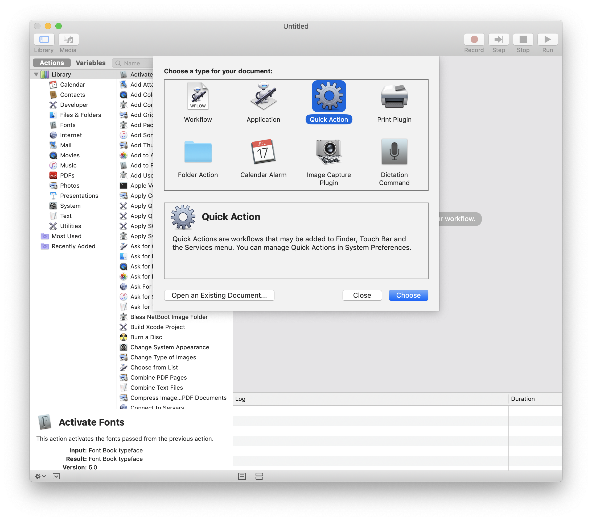
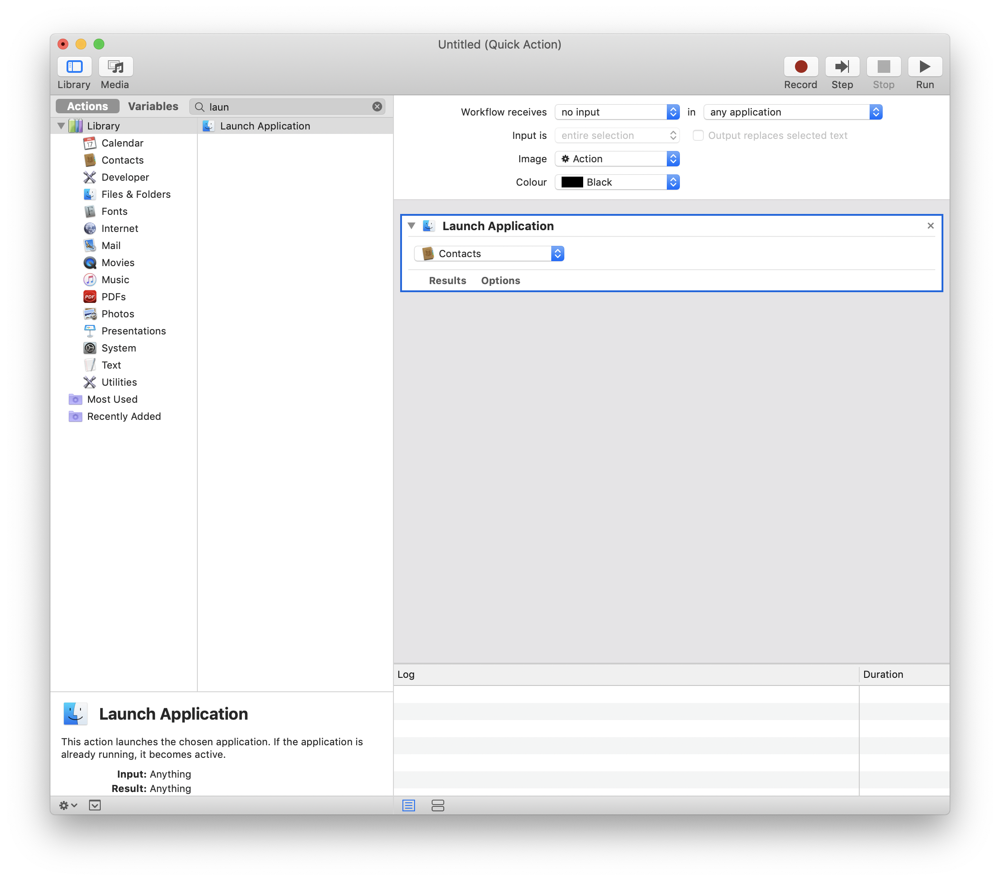
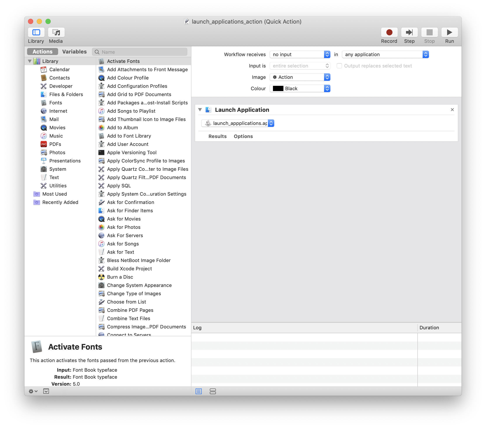
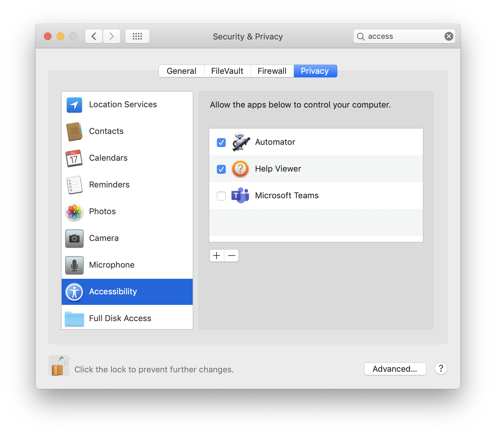
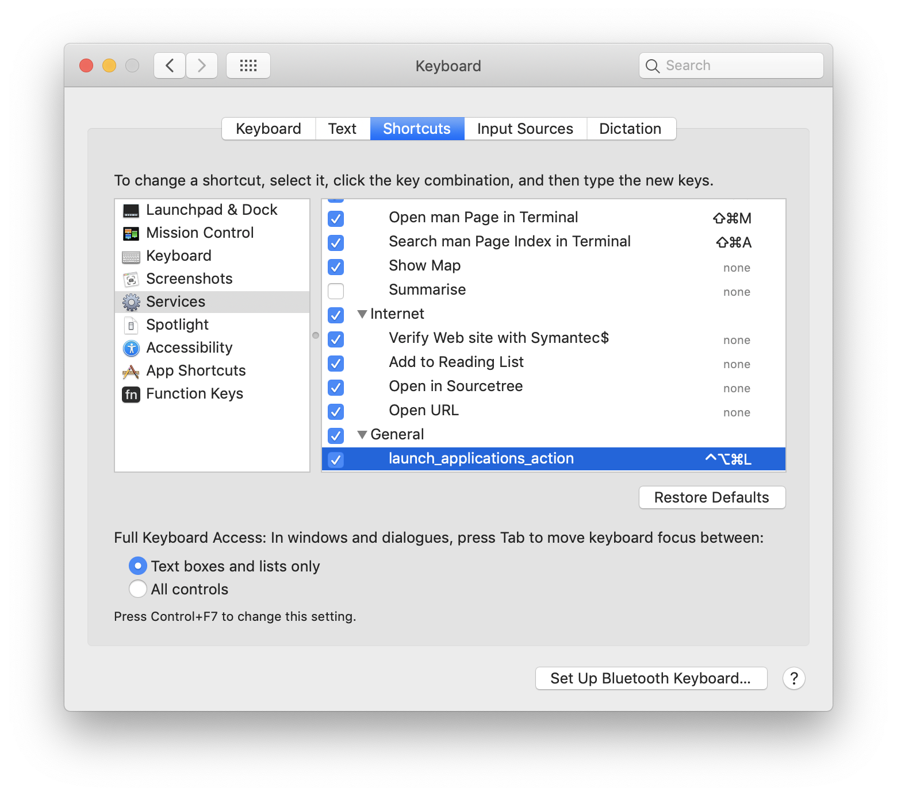

# app-launcher
I wanted to launch all my everyday applications at a keystroke. Hence this was born. Necessity, as they say, <i>is</i> the mother of invention.

## Getting Started
Simply clone the project, navigate to the directory where ```launch_applications.applescript``` is located, and then run the command from Terminal -

```AppleScript
osascript launch_applications.applescript
```

## Assign a Keyboard ShortCut to this AppleScript

If you wish to run this AppleScript at the hit of a keystroke -

Step 1 - <a href="https://www.addictivetips.com/mac-os/convert-an-applescript-to-an-app-on-macos/">Save launch_applications.applescript as an application.</a>

Step 2 - Open `Automator` on your MacOS.

Step 3 - Select `Quick Action`.


Step 4 - Select "no input" from the "Workflow receives" drop-down list.


Step 5 - Select "Launch Application" from the list of Actions and drag it to the right hand side.

Step 6 - Select the application which you saved at step 1.


Step 7 - Save the `Automator` file.

Step 8 - Go to `System Preferences` -> `Security & Privacy` -> `Privacy` -> `Accessibility` and add `Automator` to the list of apps which can control your computer.


Step 9 - Go to `System Preferences` -> `Keyboard` -> `Shortcuts` -> `Services`. You should see the `Automator` file you saved at step 7 listed. Select it.

Step 10 - Double click on "Add Shortcut" and press the shortcut keys you wish to assign to the applescript.<br>In the below screenshot I have assigned ```control (⌃) + option (⌥) + command (⌘) + L``` as the keyboard shortcut.
<br><b>Take care not to assign a shortcut already assigned to some other action on MacOS !</b>


Voila ! Click the Keyboard shortcut from any window and watch the magic happen.
